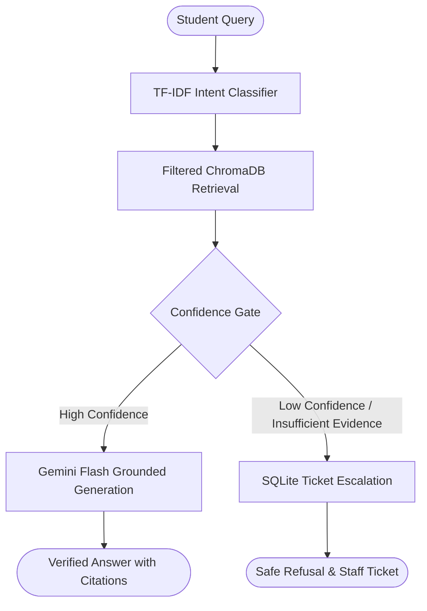

# 🎓 AdtU Campus Copilot

> **Your AI guide to Assam down town University**
>
> Campus Copilot doesn't just generate an answer — it verifies evidence before answering, and escalates when evidence is insufficient.

<div align="center">
  <p>
    <a href="ADD-LIVE-DEMO-URL"><strong>Live Demo</strong></a> •
    <a href="https://adtu-campus-copilot.onrender.com/health"><strong>Backend Status</strong></a>
  </p>
</div>

---

## 📖 Project Overview

AdtU Campus Copilot is a specialized, hackathon-MVP AI assistant built for **Assam down town University**. Designed for students and staff, it accurately answers campus questions—such as admissions requirements, fee structures, and campus facilities.

Unlike generic chatbots that hallucinate or guess answers when unsure, Campus Copilot operates on a strict **non-fabrication contract**. It relies exclusively on a locked, curated university knowledge base. If it cannot find sufficient verified evidence to answer a question, it safely escalates the query to a human staff member by creating a support ticket.

## 🚀 Why It's Different

Most RAG systems prioritize returning *an* answer over returning an *accurate* answer. AdtU Campus Copilot prioritizes **trust and safety** above all else.

### Locked Core Architecture



**Key Differentiators:**
- **Evidence-Grounded Answers:** Generation only occurs if retrieval confidence exceeds a strict threshold.
- **Non-Fabrication Contract:** It never invents policies or guesses.
- **Citations:** Every generated fact is tied to a specific chunk of source evidence.
- **Controlled OOS Recovery:** Smart vocabulary detection recovers poorly-classified queries safely.
- **Human Escalation:** When the bot is unsure, it creates a ticket for university staff.
- **Staff Workspace:** Built-in queue for administrators to review and resolve escalated tickets.

## ✨ Key Capabilities

- **Campus Q&A:** Accurate answers across admissions, fees, and facilities.
- **4-Class Intent Routing:** Categorizes queries into `admissions`, `fees`, `facilities`, or `out_of_scope`.
- **Evidence-Grounded Generation:** Uses a strict prompt instructing the model to rely only on retrieved chunks.
- **Insufficient-Evidence Escalation:** Fails safely to a SQLite-backed ticketing system.
- **Non-Fabricated Citations:** Links answers to exact knowledge base sources.
- **Scholarship Routing Correction:** Intercepts monetary queries and directs them to the fees category table.
- **Class-Routine Table Assembly:** Re-unites headers with their complex sibling timetables during retrieval.
- **Ticket Resolution / Admin Workspace:** A dedicated UI panel for staff to handle escalated support tickets.
- **Readiness Endpoint:** Robust `/health` and `/ready` checks to ensure downstream dependencies (Chroma, Gemini) are live.
- **Trust / Evidence Panel:** Every response includes an expandable "Why this answer?" UI to show intent, confidence, and exact cited text.
- **Guided Demo Mode:** One-click scenario cards on the home screen to demonstrate the system's capabilities.

## ⚙️ RAG / Safety Pipeline

| Stage | What it does | Why it matters |
|---|---|---|
| **Intent Classification** | Routes the query using a frozen TF-IDF + SVC model. | Limits search space, preventing cross-domain confusion (e.g., mixing hostel fees with tuition). |
| **Filtered Retrieval** | Embeds the query via `gemini-embedding-2` and searches ChromaDB. | Pulls the most mathematically relevant verified facts. |
| **Confidence Gate** | Evaluates if the top retrieved evidence exceeds safety thresholds. | Stops hallucination *before* the LLM generation phase begins. |
| **Safe Escalation** | If confidence is too low, creates a SQLite support ticket. | Protects the university's reputation by avoiding wrong answers. |
| **Grounded Generation** | `gemini-2.5-flash` synthesizes a readable response with citations. | Delivers a clean, conversational, trustworthy answer to the student. |

## 🛡️ Trust & Non-Fabrication

This is a core design property of the system:
1. **If evidence is sufficient:** → The system answers with grounded evidence and citations.
2. **If evidence is insufficient:** → The system returns an insufficient-evidence outcome, creates a support ticket, and **does not invent the answer.**

Every answered or escalated query presents an expandable panel detailing the backend reasoning, confidence scores, and specific data chunks retrieved.

## 🎯 Demo Scenarios

These exact scenarios are available via quick-start buttons on the Live Demo home screen:

| Scenario | Example Query | What it demonstrates |
|---|---|---|
| **Normal Q&A** | *"What documents are required for BTech admission at AdtU?"* | Baseline path: classification → retrieval → high confidence → grounded answer with citations. |
| **Scholarship Correction** | *"What scholarships are available?"* | Intercepting a monetary query to ensure it retrieves from the `fees` knowledge category despite its wording. |
| **Class Routine Assembly** | *"Show me the CSE DS & AI IBM class routine"* | Sibling-chunk expansion: reuniting a schedule header with its massive timetable chunk. |
| **OOS Recovery** | *"When is the next university holiday?"* | "Policy B" recovery: a query marked out-of-scope but containing campus keywords is given a controlled second chance to retrieve facts. |
| **Hard OOS** | *"What is the capital of France?"* | Immediate, cheap rejection without invoking embeddings or generative LLMs. |
| **Safe Escalation** | *"What is the WiFi password for the boys hostel?"* | The system attempts retrieval, finds no password, and safely generates a staff support ticket instead of guessing. |
| **Ticket Resolution** | *(Using the Admin UI)* | Staff can view the escalated ticket from the previous step and mark it resolved. |

## 💻 Tech Stack

- **Frontend:** Vanilla HTML / CSS / JavaScript
- **Backend:** FastAPI (Python 3.12)
- **Machine Learning:** Scikit-learn (TF-IDF + LinearSVC classifier)
- **RAG / Vector Store:** ChromaDB + Google `gemini-embedding-2`
- **Generation:** Google `gemini-2.5-flash`
- **Storage:** SQLite (for ticket tracking)
- **Testing:** `pytest`
- **Deployment:** Render (FastAPI Backend) & Hugging Face Static Space (Vanilla Frontend)

## 📂 Project Structure

```text
AdtU-Campus-Copilot/
├── app/
│   ├── api/          # FastAPI endpoints, health checks, and CORS configuration
│   ├── classifier/   # Frozen TF-IDF + SVC intent classification model
│   ├── database/     # SQLite ticket management and schema
│   └── rag/          # Core pipeline, retrieval logic, gating, and Gemini generation
├── frontend/         # Vanilla HTML/JS frontend (Hugging Face Space)
├── tests/            # Comprehensive pytest suite
├── evaluation/       # Performance evaluation and metrics scripts
└── data/rag/         # Raw source documents for the knowledge base
```

## 🛠️ Local Development

Follow these steps to run the complete stack locally.

1. **Clone and setup the virtual environment:**
   ```powershell
   git clone <YOUR_REPO_URL>
   cd AdtU-Campus-Copilot
   python -m venv .venv
   .\.venv\Scripts\Activate.ps1
   pip install -r requirements.txt
   ```

2. **Configure environment variables:**
   ```powershell
   Copy-Item .env.example .env
   ```
   Edit `.env` and add your `GEMINI_API_KEY`. (Do not change the model names unless necessary).

3. **Install the Knowledge Base Snapshot:**
   Extract the pre-compiled `adtu_kb_snapshot_957v_20260822.zip` into the repository root so that `data/processed/chroma_db/` and `data/processed/derived_embeddings.json` are populated.

4. **Start the Backend (Terminal 1):**
   ```powershell
   uvicorn app.api.main:app --host 127.0.0.1 --port 8000
   ```
   *Verify readiness at http://127.0.0.1:8000/ready*

5. **Serve the Frontend (Terminal 2):**
   ```powershell
   cd frontend
   python -m http.server 8080
   ```
   *Open http://localhost:8080 in your browser.*

6. **Run Tests:**
   ```powershell
   python -m pytest tests/ -q
   ```

## ☁️ Deployment Architecture

- **Frontend:** Deployed as a static application on **Hugging Face Static Space**. It uses an injected `API_BASE_URL` to communicate with the backend.
- **Backend:** Hosted on **Render**, serving the FastAPI endpoints (`/chat`, `/tickets`, `/ready`).
- **Knowledge Base:** The validated ChromaDB snapshot is fetched at startup/build time. These 957-vector binary artifacts are intentionally `.gitignore`d to prevent repository bloat and accidental overrides.

## 📦 Knowledge Base Snapshot

To avoid expensive, unnecessary API calls, the repository relies on a frozen, validated vector snapshot.

- **Vector Count:** 957 vectors (836 V1 direct, 45 V1 derived-child, 76 V2 direct)
- **Dimensions:** 768 (`gemini-embedding-2`)
- **Integrity:** SHA-256: `2d6ae1b6ecfb20e03ca69e40220f0c6a3bcd7a236d613203f0b96410a086f009`

*Note: Generating a new snapshot requires explicit approval and incurs API costs.*

## ✅ Testing

The repository maintains strict test coverage to protect the safety gating logic.

**Command:**
```powershell
python -m pytest tests/ -q
```
*(Always scope pytest to the `tests/` directory to prevent it from auto-collecting diagnostic scripts that execute real API calls).*

**Status:** **302 passed** (Verified against the latest `techlead/classifier` baseline).

## 🎪 Innovation Mela & Exhibition

**No formal presentation required — designed for interactive demonstration.**

To demo the system:
1. Open the Live Demo.
2. Click a normal scenario (e.g., *"What documents are required..."*) and expand **"Why this answer?"** to show the grounded citations.
3. Click **Safe Escalation** to deliberately trip the confidence gate. Show how the system refuses to guess.
4. Open the **Staff / Admin** sidebar to view the newly created ticket, demonstrating the end-to-end support loop.

## 🚧 Current Limitations (MVP)

As a hackathon MVP, the system has several known boundaries:
- **Authentication:** The `PATCH /tickets/{id}` admin endpoint is currently unauthenticated.
- **Ephemeral Storage:** The Render Free tier resets its filesystem periodically, meaning SQLite tickets are ephemeral.
- **Cold Starts:** Render backend may take ~50 seconds to wake up if inactive.
- **Conservative Failsafe:** The confidence gate is intentionally strict; borderline queries will safely escalate rather than risk a hallucination.

## 🗺️ Roadmap

- [ ] Authenticated staff workspace (OAuth/SSO)
- [ ] Richer backend observability and telemetry
- [ ] Stronger live regression testing against model drift
- [ ] Multilingual support (Assamese/Hindi)
- [ ] Improved structured table extraction for complex fee schedules

## 👥 Team & Credits

- **Author:** Sourav Chakraborty

---
*Built for the AdtU Campus Copilot initiative.*
